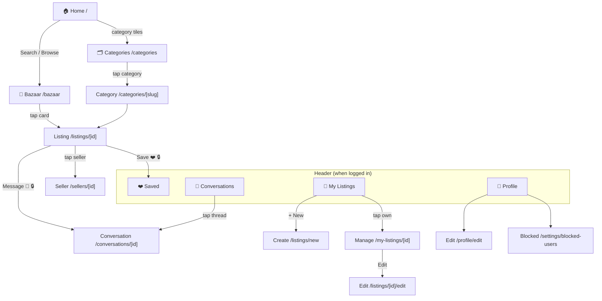

# 🧭 Hatiwal Web — Testing Guide & App Map

> For testing the app **without knowing the codebase**. It shows **every page**, **where it lives in the code**, **which mobile screen it mirrors**, **which backend feeds it**, and a **checklist to test everything**.
>
> Hatiwal is a **local marketplace for Afghanistan** — people buy and sell items, meet in person, and chat in-app. **No online payment, no delivery.** This **Next.js** site and the **hatiwal-mobile** app are two clients of the **same Rails API**: same data, same logins, same listings — this is the browser/SEO-friendly UI.
>
> One account is **both buyer and seller**. Every URL is prefixed with a **locale** (`/en`, `/ps`, `/fa`).

---

## 1. How to launch & connect

1. **Local dev:** `npm run dev` → open **http://localhost:3011**.
2. **Docker:** `docker compose up web` → open **http://localhost:8500**.
   *(Docker dev uses Turbopack and ignores file-watch polling — host edits don't always hot-reload; restart the container to apply.)*
3. First run: `cp .env.example .env.local` and set `NEXT_PUBLIC_API_URL=http://localhost:3007/api/v1`.
4. The browser never calls Rails directly — it goes through this app's **`/api/proxy`** and **`/api/me`** routes (avoids CORS, attaches your auth cookies).

**Backend must be running:** `hatiwal-api` on `:3007` (REST) and `:3098` (chat WebSocket).

### Logged in vs Guest
- You can browse, search, filter, and open detail pages **as a Guest**.
- **Login is needed for:** save/favorite ❤️, messaging a seller 💬, creating/editing listings, profile, blocking, reporting. Gated pages are wrapped in `<RequireAuth>` and redirect to `/login`.

### Demo logins (seeded)
| Role | Email | Password |
|---|---|---|
| Buyer **and** Seller | `buyer@hatiwal.test` | `Password123!` |
| Seller (has draft/active/reserved/sold) | `seller@hatiwal.test` | `Password123!` |
| Fresh buyer | `newbuyer@hatiwal.test` | `Password123!` |

Seed/reset the data: `cd hatiwal-api && bundle exec rails db:seed:e2e` (or `db:seed:reset_e2e`).

---

## 2. Navigation map (diagram)

This is a **Mermaid** diagram — it renders as a real flowchart in VS Code (Markdown Preview) or GitHub. The plain tree underneath says the same thing for the terminal.



### Plain tree (same thing)

```
/  (Home: hero search, category grid, recent listings)
│
├── 🛒 /bazaar           (marketplace: search + filters + pagination) → /listings/[id]
├── 🗂 /categories       → /categories/[slug]  → /listings/[id]
├── 📄 /listings/[id]    (detail) ── tap seller → /sellers/[id]
│                                  ├─ Message 💬 🔒 → /conversations/[id]
│                                  └─ Save ❤️ 🔒
│
├── 🔐 /login · /signup
│
└── (logged in)
       ├── 🏪 /my-listings        → + New → /listings/new
       │                          → tap own → /my-listings/[id] → Edit → /listings/[id]/edit
       ├── ❤️ /saved
       ├── 💬 /conversations      → /conversations/[id]
       ├── 👤 /profile            → /profile/edit
       └── ⚙️ /settings/blocked-users
```

---

## 3. Page-by-page map — *which page comes from where*

Every page you can reach: the **route file**, the **mobile screen it mirrors**, and the **backend** it uses. All URLs are prefixed with a locale (`/en`, `/ps`, `/fa`).

> **Backend:** there's **one Rails API**. 🟦 **REST** = normal request/response (listings, profiles, saves, reports). 🟩 **Cable** = live WebSocket (chat messages in real time). The browser reaches REST through `/api/proxy` (public) and `/api/me` (authed).

| # | Page (what you see) | URL | Code: route file | Mobile screen it mirrors | Backend | 🔒 |
|---|---|---|---|---|---|---|
| 1 | **Home** | `/[locale]` | `[locale]/page.tsx` | Home / Bazaar tab | 🟦 | |
| 2 | **Bazaar** (marketplace) | `/[locale]/bazaar` | `[locale]/bazaar/page.tsx` | Browse (buyer Home) | 🟦 | |
| 3 | **Categories index** | `/[locale]/categories` | `[locale]/categories/page.tsx` | (browse filter on mobile) | 🟦 | |
| 4 | **Category detail** | `/[locale]/categories/[slug]` | `[locale]/categories/[slug]/page.tsx` | (browse filtered) | 🟦 | |
| 5 | **Listing detail** | `/[locale]/listings/[id]` | `[locale]/listings/[id]/page.tsx` | Listing detail | 🟦 | |
| 6 | **Seller profile** | `/[locale]/sellers/[id]` | `[locale]/sellers/[id]/page.tsx` | Seller profile | 🟦 | |
| 7 | **Login** | `/[locale]/login` | `[locale]/login/page.tsx` | Login | 🟦 | |
| 8 | **Sign up** | `/[locale]/signup` | `[locale]/signup/page.tsx` | Register | 🟦 | |
| 9 | **My Listings** (seller) | `/[locale]/my-listings` | `[locale]/my-listings/page.tsx` | My Listings (seller Home) | 🟦 | ✅ |
| 10 | **Manage listing** (seller) | `/[locale]/my-listings/[id]` | `[locale]/my-listings/[id]/page.tsx` | My listing detail | 🟦 | ✅ |
| 11 | **Create listing** | `/[locale]/listings/new` | `[locale]/listings/new/page.tsx` | Create listing | 🟦 | ✅ |
| 12 | **Edit listing** | `/[locale]/listings/[id]/edit` | `[locale]/listings/[id]/edit/page.tsx` | Edit listing | 🟦 | ✅ |
| 13 | **Saved** ❤️ | `/[locale]/saved` | `[locale]/saved/page.tsx` | Saved | 🟦 | ✅ |
| 14 | **Conversations** (inbox) | `/[locale]/conversations` | `[locale]/conversations/page.tsx` | Messages | 🟦🟩 | ✅ |
| 15 | **Conversation** (thread) | `/[locale]/conversations/[id]` | `[locale]/conversations/[id]/page.tsx` | Conversation | 🟦🟩 | ✅ |
| 16 | **Profile** | `/[locale]/profile` | `[locale]/profile/page.tsx` | Profile | 🟦 | ✅ |
| 17 | **Edit profile** | `/[locale]/profile/edit` | `[locale]/profile/edit/page.tsx` | Edit profile | 🟦 | ✅ |
| 18 | **Blocked users** | `/[locale]/settings/blocked-users` | `[locale]/settings/blocked-users/page.tsx` | Blocked users | 🟦 | ✅ |
| 19 | **Privacy** | `/[locale]/privacy` | `[locale]/privacy/page.tsx` | (in-app legal) | — | |
| 20 | **Delete account** | `/[locale]/delete-account` | `[locale]/delete-account/page.tsx` | (in-app settings) | — | |

**Redirects:** `/browse` → `/bazaar` · `/users/[id]` → `/sellers/[id]` · unmatched → localized 404 (`[...rest]/page.tsx`).

> **Web-only pages** (no standalone mobile screen): `/categories`, `/categories/[slug]`, `/privacy`, `/delete-account`. On mobile, categories live as filters inside Browse.

### API route handlers (server-side glue — no business logic)
`src/app/api/` → `proxy/[...path]` (public REST tunnel) · `me/[...path]` (authed tunnel) · `auth/{login,register,logout,session,cable,delete}` · `health`. App data clients live in `src/lib/api/` (`listings.ts`, `me.ts`, `chat.ts`, `reports.ts`…).

---

## 4. Test checklist — *test everything*

Tick as you go. ⭐ = the core path; 🔒 = needs login; 🌐 = check it matches the mobile app too.

### 🔐 Auth
- [ ] ⭐ Sign up a new account → lands logged in
- [ ] ⭐ Login with `buyer@hatiwal.test` → home loads, header shows your account
- [ ] Logout → header reverts to guest; visiting `/saved` redirects to `/login`
- [ ] Guest opens a 🔒 page directly → redirected to login
- [ ] 🌐 An account created on mobile logs in here with the same data

### 🏠 Home & browse
- [ ] ⭐ Home loads: hero search, category grid, recent listings
- [ ] Hero search → lands on `/bazaar` with the query applied
- [ ] ⭐ Bazaar shows listing cards (photo, price, title, location)
- [ ] Filters (category, price, condition, province) update results **and the URL**
- [ ] Pagination works; sort changes order
- [ ] Categories index → category detail lists the right items
- [ ] Empty search → friendly empty state

### 📄 Listing detail
- [ ] ⭐ Opens with photo gallery, price prominent, seller identity, location map
- [ ] 🔒 ❤️ Save toggle (prompts login as Guest)
- [ ] 🔒 💬 Message seller → starts a conversation
- [ ] Tap seller → Seller profile (their active listings)
- [ ] Report listing (🔒) submits
- [ ] Page has correct title/meta (SEO) and JSON-LD

### 🏪 Seller dashboard (🔒)
- [ ] ⭐ **+ New** (`/listings/new`) → create a listing → it appears in My Listings
- [ ] Status badges: draft / active / reserved / sold
- [ ] Manage listing → **Edit** saves changes
- [ ] Mark reserved / sold / re-activate; delete (confirm first)

### 💬 Conversations (🔒)
- [ ] Inbox lists conversations
- [ ] ⭐ Open a thread → send a message → it appears
- [ ] 🌐 Reply from the mobile app → message arrives **live** here (Cable)
- [ ] Block a user → appears in `/settings/blocked-users`; unblock works

### 👤 Profile (🔒)
- [ ] Profile shows your data + quick links (my listings, saved, settings)
- [ ] Edit profile saves (name, avatar, phone, location)

### 🌍 Cross-cutting
- [ ] Header nav works; logo → home; breadcrumbs correct
- [ ] Colors look right in **light** and **dark** mode (theme toggle)
- [ ] Switch locale to **پښتو** / **دری** → text translates **and layout flips RTL** (`<html dir>`)
- [ ] Static pages load: `/privacy`, `/delete-account`
- [ ] Redirects: `/browse` → `/bazaar`, `/users/[id]` → `/sellers/[id]`; bad URL → 404
- [ ] No error screens / hydration warnings in console

---

## 5. The backend (so errors make sense)

There's **one Rails API** (`hatiwal-api`) shared with the mobile app. The browser reaches it through this app's own API routes:

| | 🟦 REST (via `/api/proxy`, `/api/me`) | 🟩 Cable / WebSocket (`:3098`) |
|---|---|---|
| Carries | listings, categories, profiles, saves, reports, sending a message | **live** message delivery, read receipts |
| If it fails | a list/detail shows an error or empty state; create/save fails | messages send but **don't appear live** until reload |

So: if a **catalog/profile** page breaks → REST/proxy issue (check `/api/proxy` & `NEXT_PUBLIC_API_URL`). If chat works but **new messages don't pop in live** → the Cable connection. If **personal** features (save, profile, my listings) fail → usually login/cookies (`/api/me`, `/api/auth/session`).

Because web and mobile share this one API, **data created on either must work on the other** — worth spot-checking (the 🌐 items above).

---

## 6. If something looks broken — tell Claude

Say **which page** (use the names/numbers in section 3) and **what you saw** (error text, blank area, wrong colors, broken redirect). The map above lets Claude jump straight to the file. Example: *"Bazaar → price filter doesn't update results"* → that's `src/components/browse/browse-client.tsx` + `filters.ts`.

---

## 7. Automated tests (for when you do know the codebase)

The web client uses **Playwright** for end-to-end browser tests (no separate unit layer).

| Layer | Tool | Where | Run |
|---|---|---|---|
| E2E | Playwright | `e2e/*.spec.ts` (25 specs) | `npm run test:e2e` |
| — debug | Playwright UI | — | `npm run test:e2e:ui` |
| — report | HTML report | — | `npm run test:e2e:report` |

Tests run against a deterministic **mock API** (`e2e/mock-api/server.mjs` on `:4010`) and an isolated dev server (`:3210`, build dir `.next-e2e`) — they don't touch your local `:3011`. Auth/session is set up once in `e2e/auth.setup.ts`.

Before shipping: `npm run test:e2e` ✅ · `npm run lint` ✅ · `npm run build` ✅.
